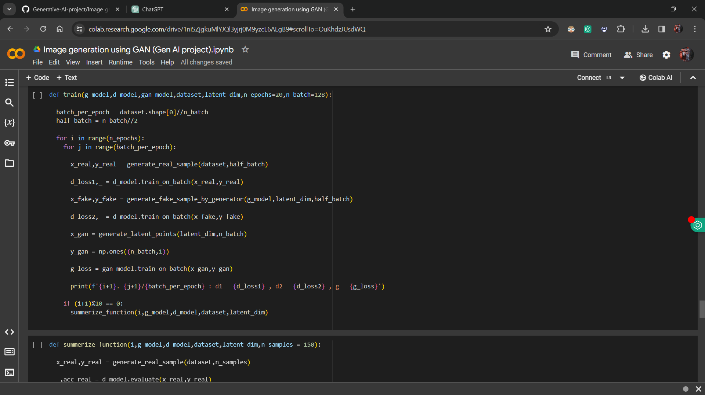
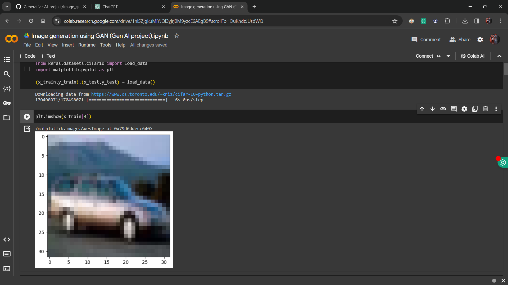
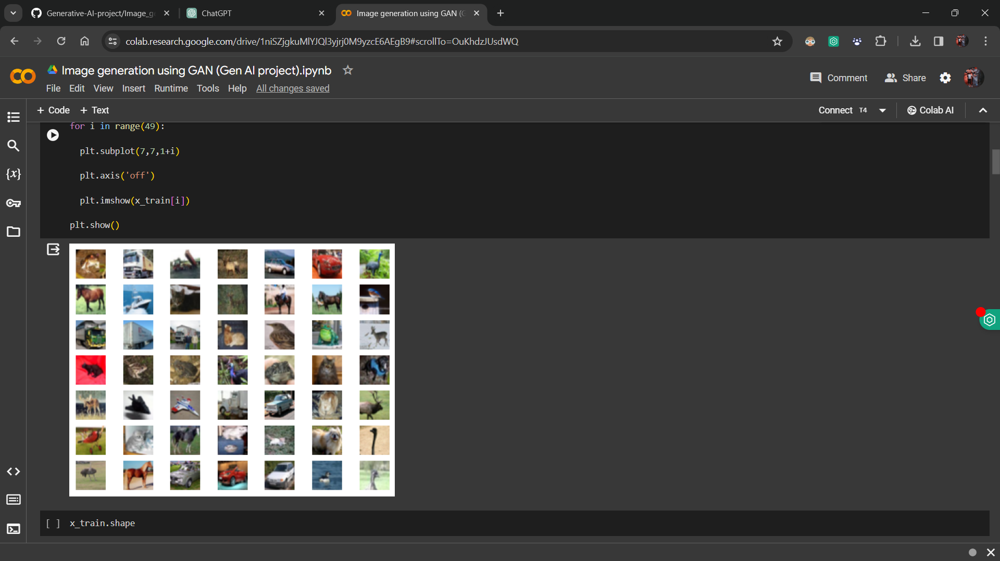

# 🎨 Gen AI - Image Generation using GANs

**Gen AI** is a project designed to generate CIFAR-10-like images using **Generative Adversarial Networks (GANs)**. The custom GAN model features a **Generator** and a **Discriminator**, collaboratively trained to create realistic images while distinguishing between real and generated ones.

---

## 📜 Table of Contents
- [✨ Key Features](#-key-features)
- [🌟 Use Case](#-use-case)
- [🚀 Usage](#-usage)
  - [🛠️ Setup](#️-setup)
- [📷 Screenshots](#-screenshots)

---

## ✨ Key Features
- Trains a **custom GAN model** on the CIFAR-10 dataset.
- Generates high-quality images resembling CIFAR-10 with unique variations.
- Compatible with **Jupyter Notebooks** and **Google Colab** for training and image generation.

---

## 🌟 Use Case
1. **Data Augmentation**: Generate synthetic images to enrich existing datasets.
2. **Concept Exploration**: Create innovative concepts and artistic visuals.
3. **Prototyping**: Quickly generate images for mock-ups and design testing.

---

## Screenshots

